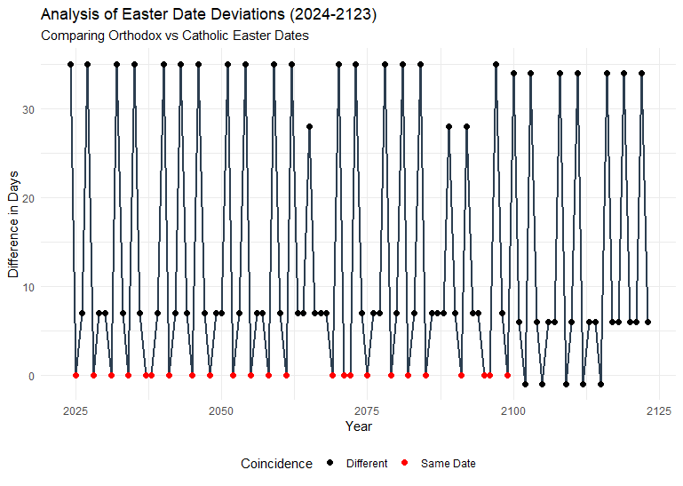

# Statistical Analysis of Easter Dates (2024–2123)

## Project Overview
This project analyzes the deviations between Orthodox and Catholic Easter dates for the next century. Using **R** and **Modular Arithmetic**, I implemented the Meeus algorithm to calculate and visualize these dates.

## Mathematical Foundation
The calculation is based on **Number Theory** and **Modular Arithmetic** (Modulo 19 for the Metonic cycle and Modulo 7 for the Solar cycle). 

Key findings:
* **Coincidence:** Years when both dates align (Difference = 0).
* **Maximum Deviation:** Periods where the difference reaches 35 days.

## Data Visualization

## Technical Skills Used
* **Programming:** R (dplyr, ggplot2)
* **Statistical Methods:** Time-series analysis, descriptive statistics.
* **Algorithm Implementation:** Meeus algorithm (Julian vs Gregorian calendar).

## Author
Nefeli Spilioti
